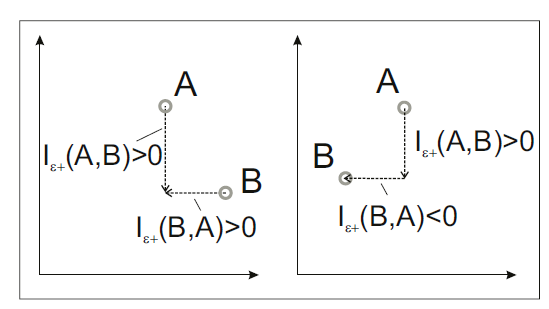

# Constraint Solver for Software Engineering
Project for CSC510 2015 spring

## Background
Modern software engineering is becoming more and more complex. Some commercial software platforms are required to equip with hundreds, even thousands of features, such as enable security network, enable scalable database, customizable GUI, etc. SPLOT(Software Product Lines Online Tools) contains hundreds of feature model instances. Some of them has more than 300 features.  

Among all of the features in a model, there are some constraints. That is, some features are related to each other.  
Implementing all features in a software project maybe impossible. I need some tools to determine which feature should be furnished at first. A good plan can shorten development time or cost, make the product more competitive in market.

## Requirements and Goals
This is a very simple feature model.

In this model, E-shop can be divided into 4 sub-feature points: catalogue, payment, security and search. Among them, search is optional, and others are mandatory. In payment sub-feature, it can be bank transfer, credit card or both of them. Security can be high or standard.  

If the above are all problem statement, this problem is quit simple, I can pick up the features from root to leaves. But in this example, their is one cross-tree constraint: CreditCard implies High security.  

Due to the cross-tree constraints, the problem become much more complex. As I all know, SAT is a NP-hard problem. Essentially, the cross-tree constraints in this problem can be expressed as SAT.

So ultimately this is a optimization problem, specifically, a binary variable optimization problem. The objectives are: try to find out as much features as possible, and follow as much constraints as possible.

In abstract, the feature model can be translated into a optimization problem: let the leaves feature be arguments, get the total satisfied feature and satisfied constraint as two objectives. Our goal is to find the settings for leaves feature (which are binary variables) so that two objectives can be optimized.

Also, in the software project, develop cost, precedentness and defects are very important factors which should not be ignored. Consequently, adding these three objective into the problem can make this tool more poIrful. How to define the "best" solution and how to solve this problem will be discussed in the latter section.

To summary, this project accepts a feature model, as Ill as some attributes of features, and returns which feature should be implemented.

## Methods
### Feature fetch and translation
SPLOT(splot-research.org) has a open feature model repository. All models in this project are fetched from this repository. In the SPLOT repository, feature models are expressed in SXFM language. To parse it, I apply the parser provided by this repository.

After parsing the feature models, I can get all the leaf features. They are the arguments to be determined. In the "E-Shop" example, arguments include: Catalogue, BankTransfer, CreditCard, HighSecurity, Standard and Search.

After creating the arguments, I calculated the objectives as follows:
-  Richness of features: for a non-leaf tree node in feature model, if all mandatory children as satisfied and at least one child to be true, then that non-leaf tree feature is satisfied, i.e., equals 1. For the group node (OR/XOR), following the logic definition and set up the group node. The number of satisfied features indicates the richness of features offering in the output plan.
-  Constraint violations: after get all the features, check each cross-tree constraints. The number of all unsatisfied constraint is the index of constraint violations.
- Cost: first assign each feature with a cost. Sum all of the offered feature at the end and get the cost.
- Defects: This is similar to the cost. 
- Familiarity: mark which feature has been used before at first. Later count how many features are newly to the developers. This indicates the familiarity for the project.

Among all of these five objectives, I hope the richness, familiarity to be greater and violations, cost and defects to be smaller. For simplicity, I reverse the first two positive objectives. Consequently, I should minimize all of the five objectives.

### Discrete genetic algorithms/Differential Evaluations
Differential Evaluation is one kind of genetic algorithms to solve the optimization problem. Following is a belief introduction to this algorithm.

- First, an initial set of solutions are set. I call it initial population.
- During the evolution, three distinct "parent" can generate a trial solution by A+f*(B-C). If the trial is "better" (to be defined) than the origin parent, then I replace it. Otherwise, I can ignore it or add it to the solution pool.
- If the stopping criteria is satisfied (This will be discussed later), terminate and output the result. Otherwise, continue go back and perform the DE.

Please note that I do not plan to find one setting/result. Because it's likely that it is impossible to get a result with best values for all objectives. I want to find a set of results, which is the approximation of pareto frontier. Theoretically, I can't find a solution whose all objective value are better than one in pareto frontier.

In the differential evaluation, I have to determine whether a new individual(solution) is better than the one already in the population. Here, "better" means "dominates", that is, for all objectives, "no worse than", and exist one objective, "better".

The stopping criteria is another issue I need to pay attention. The simplest criteria is the maximum generation count. I can also track the improvement for each generation. If the accumulated improvement is less than one threshold, terminates the program.

### Continuous genetic algorithms/Indicator-based Evolution
In the discrete genetic algorithm, the main generating motive is eliminating the worse individuals and replacing them with a new individual. In other words, I only care about whether one is better or worse than anther, I do NOT take to what extend one is better/worse than anther into consideration. HoIver, it's not difficult to know that the extend of "better" or "worse" can give us a more precise evolution direction. This is the basic idea for Indicator-Based Evolution Algorithm (IBEA).

Following is a belief introduction to IBEA.
- First step is the same as DE.
- Calculate the fitness value (discuss later) of each individuals in current population. Repeat to eliminate the individuals with the smallest fitness, until the population size is less than a predefined size.
- Generating the mating pool, which is the same as typical genetic algorithms.
- Apply the recombination and mutation operators to the mating pool; add them to the population
- If the stop criterion is not met, go back to the second step; otherwise, terminate the program.

The stop criterion can be the same as differential evolution here.

The core for IBEA is the fitness assignment (step 2). Note that fitness assignment tries to rank the population members according to their usefulness regarding the optimization goal. I used the eplson-additive fitness indicator, that is, the minimum distance by which a Pareto set approximation needs to be translated in each dimension in objective space such that another approximation is Iakly dominated.(No worse than, but can be same). This is an illustration from [7].

Test cases shoId that IBEA indeed returns a better result.

## Testing procedure
There are several packages(components) in this project.

DEMO is the differential evaluation algorithm whose search space is continuous. Although this is not applied at the end, it provided a good reference/chance to understand this algorithm. Many standard test problem have been built inside it, such as ZDT, DTLZ, etc. Just to change the problem in "multiobjective" and run it. The result will saved when the calculation terminates.

SXFM_Parser is a Java Project, which is built on the SXFM parser provided by SPLOT. To test it, first one should find a SXFM formatted file. Provide the URL of this file in GenerateFeatureAttribute.java. The program will return the logic expression for each feature, along with all the constraint expression. One can compare these outputs with the visualized tool in SPLOT Ibsite.

Product lines is the core for this project. One can run the testEntrance and get the visualized result directed. Package "DE+NSGAII" and "IBEA" are algorithm implements. In product line package, "Ib portal" model is pre-built. One can also use the SXFM_Parser to build any other feature models.

Product lines also contains a comparison tool call "CompareByXtile". One can use this tool to compare any variable sets after they get the final result.

## Results
### What is so-called a good result?
As is introduced above, at the end of the evaluations, I can get a set of populations, which are the setting for leaf-feature in the feature model. Here comes a question: if I have two sets of populations, which one is better? Which one should I accept? To rubric is:
- do they satisfy cross-tree constraints? Cross-tree constraints complex the optimization problem. Thus, a good result should meet the cross-tree constraints as much as possible.
- how many effect individuals can I get? Although two set of populations share the same population size, they may not spread in the same extend. Consequently, I use a index--"spread" to express the extend for the spread of populations. The higher "spread" is, the more distinct individuals I can get, thus more preferable.
- do they near the Pareto front? In some sense, Pareto front is the optimized result I can get. [6] introduced an indicator call "hypervolume". This was applied in my project. The high "hypervolume" a population has, the more preferable it is.

### Comparison for two methods
The following results are based on the [model](https://github.com/smartSE/constraintAnalysis/blob/master/ExperimentResult/Ib%20portal%20feature%20tree.txt)

I first ignore the defects (that is, there Ire four objectives in total). Here is the result:

Correctness is not shown here. Since it was the same (CORR = 83%) in two methods at the end.

From the result, the IBEA got 11%(20.7 vs 18) more features than differential evaluation with only 3.7%(172 vs 168) cost and 7% less familiarity. 

The following figure shows the relative scores for all objectives in IBEA.

I can see that the algorithm converge at around 100 evolutions.

The following table is the HV and spread indicators for two methods. From it, I can see that IBEA outperform DE. This result is from a much larger feature [model](http://gsd.uwaterloo.ca:8088/SPLOT/models/REAL-FM-4.xml) (this will be demonstrated in the presentation)

2objs = Constraint correctness+Feature richness  
3objs = Constraint correctness+Feature richness+Cost  
4objs = Constraint correctness+Feature richness+Cost+Familiarity    
5objs = all

## Conclusion
Belief conclusion:
- IBEA converges slightly sloIr that that of DE
- IBEA outperforms DE in sense of HV and spread indicators

Analysis:

Since the IBEA use the fitness to motivate the evaluation, it is not surprise that it can get better HV and spread. HoIver, calculating the fitness is time-consuming. Consequently, running IBEA takes a little longer time. Also, from the result figures, I noticed that there are some exception points in IBEA. From my point of view, this is because of the mutation operators in IBEA. HoIver, this is not a bad thing. First, it is very normal that a genetic algorithm generates exception result. Second, it can provide more search direction among the search space, which can avoid local optimization to some extend.

## Discussion
### Just ignore the non-dominate individual?
In the differential evaluation, if one trial dominates the original one already in the population, I replace the original one with the new individual; and if the original one dominates the trial one, obviously, I should discard the trial. But what if they are indifferent? That is, for some objectives, the trial is better, while for other objectives, the trial is worse. Inspired by [9], I add the trial into the population. If so, pruning is a must. Consequently, I applied the pruning method introduced in [9]-NSGAII. All of the upper DE results were containing this method.

### Does it improve in this generation?
Now this report remains one question to solve: when to terminate the algorithm? Obviously the termination should be based on whether the new generation is better than the older one. If the evolutionary process is heading to a wrong direction(the accumulated improvement is negative), the algorithm must be terminated. We can use the probability-- randomly pick up two individuals from two generations, the individual in new generation dominates the old one. If this probability is less than a threshold for many times, we terminates the algorithm. 

## Future Work
- Actually this problem is a SAT problem, or NP-hard problem. There are many types of solutions to handle this problem besides the genetic algorithm. For example, Chaff algorithm is one of this. Z3, Satz solvers provide another possibility to optimize this problem. In the future, I will try these methods and compare them.
- All of the processing in this project are automatically tools. But whether we can reduce the search space? In actual application, the developer mush have some priority or preferences, this information may be able to reduce the search space. All of the methods in the current project cannot handle this information. This remains to solve in the future.

## References
[1] Storn, Rainer, and Kenneth Price. "Differential evolution–a simple and efficient heuristic for global optimization over continuous spaces." Journal of global optimization 11.4 (1997): 341-359. 

[2] Abbass, Hussein A., Ruhul Sarker, and Charles Newton. "PDE: a Pareto-frontier differential evolution approach for multi-objective optimization problems." Evolutionary Computation, 2001. Proceedings of the 2001 Congress on. Vol. 2. IEEE, 2001.  

[3] Robič, Tea, and Bogdan Filipič. "DEMO: Differential evolution for multiobjective optimization." Evolutionary Multi-Criterion Optimization. Springer Berlin Heidelberg, 2005.

[4] Deb, Kalyanmoy, et al. "Scalable multi-objective optimization test problems." Proceedings of the Congress on Evolutionary Computation (CEC-2002),(Honolulu, USA). Proceedings of the Congress on Evolutionary Computation (CEC-2002),(Honolulu, USA), 2002. 

[5] Pampara, Gary, Andries Petrus Engelbrecht, and Nelis Franken. "Binary differential evolution." Evolutionary Computation, 2006. CEC 2006. IEEE Congress on. IEEE, 2006.  

[6] Zitzler, Eckart, and Lothar Thiele. "Multiobjective evolutionary algorithms: a comparative case study and the strength Pareto approach." evolutionary computation, IEEE transactions on 3.4 (1999): 257-271.  

[7] Zitzler, Eckart, and Simon Künzli. "Indicator-based selection in multiobjective search." Parallel Problem Solving from Nature-PPSN VIII. Springer Berlin Heidelberg, 2004.  

[8] Sayyad, Abdel Salam, Tim Menzies, and Hany Ammar. "On the value of user preferences in search-based software engineering: A case study in software product lines." Software engineering (ICSE), 2013 35th international conference on. IEEE, 2013.  

[9] Deb, Kalyanmoy, et al. "A fast and elitist multiobjective genetic algorithm: NSGA-II." Evolutionary Computation, IEEE Transactions on 6.2 (2002): 182-197.  

[10] Sayyad, Abdel Salam, et al. "Scalable product line configuration: A straw to break the camel's back." Automated Software Engineering (ASE), 2013 IEEE/ACM 28th International Conference on. IEEE, 2013.
